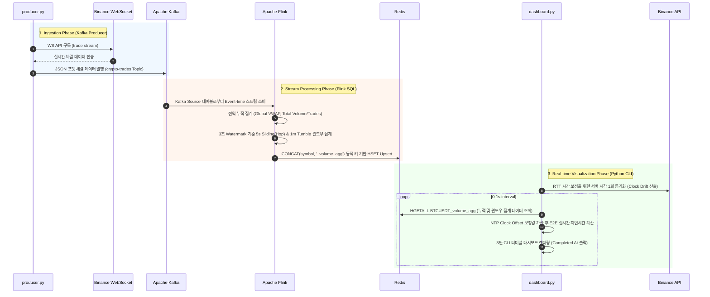
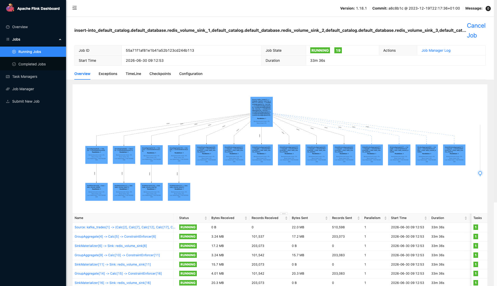
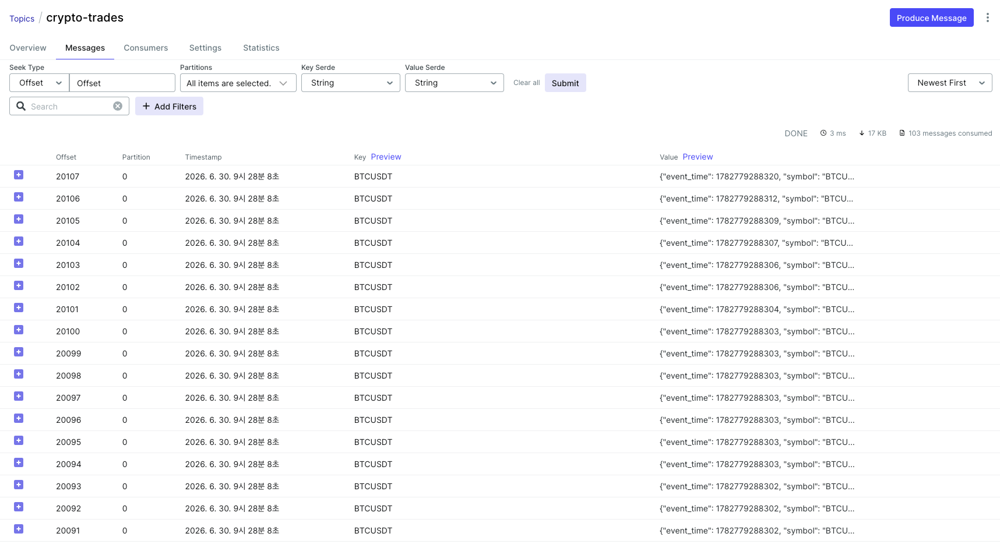
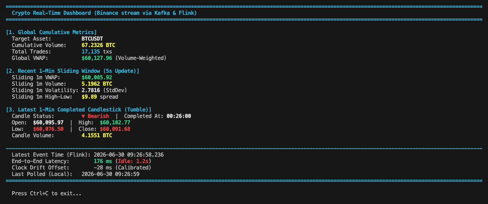

# Kafka-Flink Real-Time Crypto Streaming PoC

이 프로젝트는 **Binance WebSocket API**, **Apache Kafka**, **Apache Flink**, **Redis**, 그리고 **Python CLI 대시보드**를 연동하여, 암호화폐 거래 체결 데이터(Trades)의 실시간 수집부터 스트림 윈도우 집계·적재, 최종 저지연 시각화까지 아우르는 **End-to-End 실시간 데이터 파이프라인**을 검증하는 Proof of Concept(PoC) 환경입니다.

특히 분산 스트리밍 환경에서 시간차(NTP Clock Drift)를 동적으로 보정하고, Flink 윈도우 완료 시점 메타데이터를 활용하여 실시간 데이터의 정확성과 저지연 전송 성능을 검증합니다.

---

## 1. 아키텍처 및 데이터 흐름 (Architecture)

### 데이터 흐름

```text
[Binance WebSocket]
       │ (Real-time Live Trade Stream)
       ▼
  [producer.py] (Python Kafka Producer)
       │ (Kafka Topic: crypto-trades)
       ▼
 [Apache Kafka] ◄── [Kafka UI] (Topic Monitoring)
       │
       ▼ (Event-Time with 3s Watermark)
 [Apache Flink] ◄── [Flink Web UI] (Stream Topology)
       ├── Cumulative Metrics (Global VWAP, Total Trades)
       ├── Sliding 1-Min Metrics (Hop: 5s slide / VWAP, Volatility, Spread)
       └── Completed 1-Min Candlestick (Tumble: 1m size / OHLCV)
       │
       ▼ (Upsert Stream via hset)
   [Redis] (Dynamic Key: symbol_volume_agg)
       │
       ▼ (0.1s Polling & NTP Calibration)
 [dashboard.py] (CLI Terminal UI Dashboard)
```

### 실시간 데이터 처리 시퀀스

본 스트리밍 파이프라인은 Flink의 Event-Time 워터마크와 Redis의 분산 캐시 Upsert 흐름을 통해 실시간 저지연 데이터 전송을 수행합니다.



---

## 2. 로컬 실행 방법 (Quick Start)

### 사전 요구 사항

- Docker 및 Docker Compose
- Python 3.12+ (로컬 대시보드 및 프로듀서 구동용)

### ① Python 패키지 설치

프로젝트 루트 디렉토리에서 패키지를 설치합니다:

```bash
pip install -r requirements.txt
```

### ② 인프라 컨테이너 기동

Docker Compose를 사용하여 Kafka, Flink, Redis 스택을 구동합니다:

```bash
docker compose up -d
```

- **인프라 모니터링 주소**:
    - Apache Flink Web UI: [http://localhost:8081](http://localhost:8081)
    - Kafka UI Dashboard: [http://localhost:8080](http://localhost:8080)

### ③ Flink SQL 작업 배포 (자동 실행)

인프라 기동(`docker compose up -d`) 시, Docker Compose의 `depends_on` 조건에 따라 JobManager의 Healthcheck가 통과된 후 `flink-sql-client` 컨테이너가 시작됩니다. 이 컨테이너는 **`flink-job.sql` 잡을 자동으로 배포**하도록 구성되어 있습니다.

따라서 별도의 수동 배포 작업 없이, 의존 서비스가 준비되는 즉시 실시간 집계 파이프라인이 동작합니다.

- **수동으로 Flink SQL CLI 환경에 진입하려는 경우**:
    ```bash
    docker compose exec flink-sql-client sql-client.sh
    ```

### ④ 프로듀서 및 대시보드 구동

별도의 터미널에서 아래 스크립트를 각각 가동합니다:

```bash
# 터미널 1: 실시간 바이낸스 데이터 스트림 전송
python producer.py

# 터미널 2: 초저지연 터미널 모니터링 대시보드 구동
python dashboard.py
```

---

## 3. 실시간 PoC 검증 성과 (Verification Results)

### 📊 Flink Web Dashboard 스트림 토폴로지

Flink JobManager에서 시각화된 SQL Dataflow 그래프와 처리량 지표 상태입니다:


### 📈 Kafka UI 실시간 토픽 인입 상태

Kafka UI를 통해 토픽(`crypto-trades`)으로 바이낸스 체결 데이터가 지속적으로 정상 유입 중인지 모니터링하는 화면입니다:


### 🔍 Real-Time CLI Dashboard (NTP Drift 보정)

최종 사용자 대시보드 구동 화면입니다. 1분 텀블링 캔들이 마감될 때마다 Flink의 정확한 마감 시간 메타데이터(`Completed At`)가 표시되며, Clock Drift 오차 보정을 적용해 실제 **약 200 ms 이내** 수준의 E2E 지연 성능을 확인할 수 있습니다:

